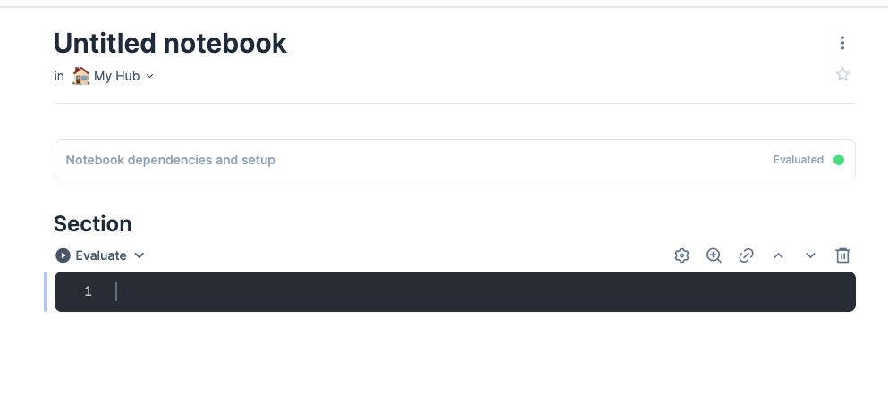

# Learning Livebook

_9/3/2024_

Elixir's [Livebook](https://livebook.dev) is a modern take on notebook style environments such as [Jupyter](https://en.wikipedia.org/wiki/Project_Jupyter).

The idea behind these environments is that you can manage snippets of code to do data discovery style tasks.  They have an integrated GUI, so you can plot the results in chart form.  Over the years the use cases have been expanded which I'll talk about.  But think of them as somewhere between a REPL/shell and a full application.  They can be used to learn a language or try a concept quickly.

In this post, I'll introduce the concept and how to use it for some common data processing tasks.

## Getting started

The easiest way to get started is to download the installer from https://livebook.dev/.  Once it's running start a new notebook.

It will look something like this 

## Elixir

